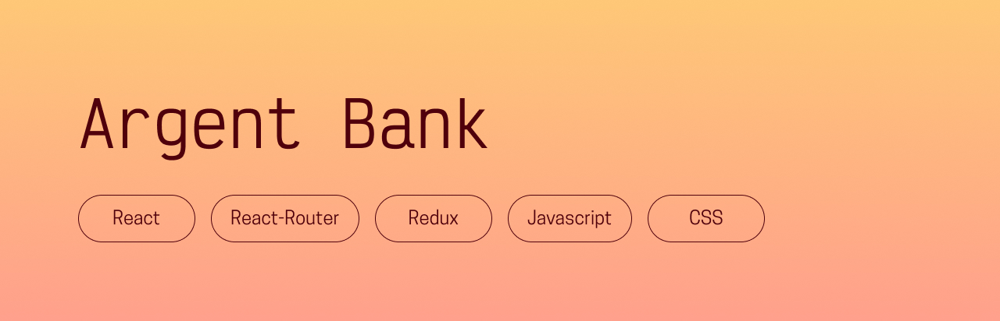

## Presentation
This is a website for a fictional bank called ArgentBank. 
This is project #13 of my OpenClassrooms front-end development course!

## Prerequisites
- [NodeJS (version 16.17.0)](https://nodejs.org/en/)
- [NPM (version 9.4.0)](https://www.npmjs.com/)

## Installing the app

### Back-end
This repository is the front-end part of the website. The back-end is in [this repository](https://github.com/OpenClassrooms-Student-Center/Project-10-Bank-API) – you first need to follow their instructions to install it.

### Front-end
Once the back-end is installed:
- Fork and clone this repository
- Run `$ npm install` to install all dependencies

## Running the app

### Back-end
- Move to the root of the back-end repository on your machine
- Run `$ npm run dev:server`

### Front-end
Once the back-end is running:
- Open a new terminal
- Move to the root of the front-end repository on your machine
- Run `$ npm start`

## Thanks for reading, and happy coding!  
Chloé Adrian